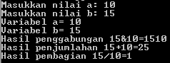

# Input Dan Output

## LAB 1
### 1.  Penggunaan end
* ```end``` adalah karakter yang dicetak di akhir baris. Defaultnya adalah tanda _newline_ (baris baru).
* Buka text editor, kemudian salin kode ini ke text editor


      1  #penggunaan end
      2  print('A', end='')
      3  print('B', end='')
      4  print('C', end='')
      5  print()
      6  print('X')
      7  print('Y')
      8  print('Z')
      9  

* Simpan dengan nama **lab1.py**, kemudian buka **Terminal** atau **CMD**, ketik ```python lab1.py```

    

* Jika program diatas telah di jalankan maka akan menampilkan output sebagai berikut :

    

* Keterangan :

  - Pada huruf **A,B,C** (pada baris 2 sampai 4) kita menambahkan fungsi ```=end''``` agar huruf yang ditampilkan menjadi satu baris. Dan perintah ```print``` akan membuat huruf **ABC** tampil di layar.

  - Dan perintah ```print()``` (pada baris 5) membuat tampil di layar.

  - Sedangkan baris 6,7,8 pada huruf **X,Y,Z** kita tulis manual dengan masing-masing huruf berbeda baris. Maka output yang ditampilkan akan berbeda baris.


      X
      Y
      Z

### 2.  Penggunaan sep
* ```sep``` atau _separator_ berfungsi sebagai tanda pemisah antar objek yang dicetak. Defaultnya adalah tanda spasi.
* Salin kode ini ke text editor


      10  # Penggunaan separator
      11  w, x, y, z = 10, 15, 20, 25
      12  print(w, x, y, z)
      13  print(w, x, y, z, sep=',')
      14  print(w, x, y, z, sep='')
      15  print(w, x, y, z, sep=':')
      16  print(w, x, y, z, sep='-----')
      17  

* kemudian simpan, lalu pada **Terminal** atau **CMD**, ketik ```python lab1.py```

    

* Jika program diatas telah dijalankan maka akan menampilkan output sebagai berikut :

    

* Keterangan :

  - Pada baris 11 kita memberi nilai pada variabel :

      **w** = 10,
      **x** = 15,
      **y** = 20,
      **z** = 25

  - Pada baris 12, perintah ```print``` mencetak variabel **w, x, y, z** ke layar. Sehingga outputnya menjadi>>> **10 15 20 25**

  - Pada baris 13, perintah ```sep=','``` memberi tanda koma (,) antara variabel **w, x, y, z**. Sehingga outputnya menjadi>>> **10,15,20,25**

  - Pada baris 14, perintah ```sep=''``` menghapus jarak/spasi  antara variabel **w, x, y, z**. Sehingga outputnya menjadi>>> **10152025**

  - Pada baris 15, perintah ```sep=':'``` menambahkan titik dua (:) antara variabel **w, x, y, z**. Sehingga outputnya menjadi>>> **10:15:20:25**

  - Pada baris 16, perintah ```sep='-----'``` menambahkan tanda strip (-) antara variabel **w, x, y, z**. Sehingga outputnya menjadi>>> **10-----15-----20-----25**

### 3.  String format
* String adalah tipe data yang digunakan untuk menyimpan karakter.
* Tanda kutip tunggal sama dengan tanda kutip ganda.
* Salin kode ini ke text editor


      18  # String format
      19  print(0, 10**0)
      20  print(1, 10**1)
      21  print(2, 10**2)
      22  print(3, 10**3)
      23  print(4, 10**4)
      24  print(5, 10**5)
      25  print(6, 10**6)
      26  print(7, 10**7)
      27  print(8, 10**8)
      28  print(9, 10**9)
      29  print(10, 10**10)
      30

* Kemudian simpan, lalu pada **Terminal** atau **CMD**, ketik ```python lab1.py```


  

* Jika program diatas telah dijalankan maka akan menampilkan output sebagai berikut :

    

* Keterangan :

  - Pada baris 19, cetak **0**, dan **10 ****(pangkat) **0** hasilnya **1**. Maka outputnya >> **0 1**
  - Pada baris 20, cetak **1**, dan **10 ****(pangkat) **1** hasilnya **10**. Maka outputnya >> **0 10**
  - Pada baris 21, cetak **2**, dan **10 ****(pangkat) **2** hasilnya **100**. Maka outputnya >> **0 100**
  - Pada baris 22, cetak **3**, dan **10 ****(pangkat) **3** hasilnya **1000**. Maka outputnya >> **0 1000**
  - Pada baris 23, cetak **4**, dan **10 ****(pangkat) **4** hasilnya **10000**. Maka outputnya >> **0 10000**
  - Pada baris 24, cetak **5**, dan **10 ****(pangkat) **5** hasilnya **100000**. Maka outputnya >> **0 100000**
  - Pada baris 25, cetak **6**, dan **10 ****(pangkat) **6** hasilnya **1000000**. Maka outputnya >> **0 1000000**
  - Pada baris 26, cetak **7**, dan **10 ****(pangkat) **7** hasilnya **10000000**. Maka outputnya >> **0 10000000**
  - Pada baris 27, cetak **8**, dan **10 ****(pangkat) **8** hasilnya **100000000**. Maka outputnya >> **0 100000000**
  - Pada baris 28, cetak **9**, dan **10 ****(pangkat) **9** hasilnya **1000000000**. Maka outputnya >> **0 1000000000**
  - Pada baris 29, cetak **10**, dan **10 ****(pangkat) **10** hasilnya **10000000000**. Maka outputnya >> **0 10000000000**

## 4. String format (Perataan string)
* Nilai yang diformat mengambil lebar sebanyak karakter yang di presentasikan.
* ```format()``` merupakan _style formatting_ yang baru.
* Salin kode ini ke text editor


      31  # String format
      32  print('{0:>3} {1:>16}'.format(0, 10**0))
      33  print('{0:>3} {1:>16}'.format(1, 10**1))
      34  print('{0:>3} {1:>16}'.format(2, 10**2))
      35  print('{0:>3} {1:>16}'.format(3, 10**3))
      36  print('{0:>3} {1:>16}'.format(4, 10**4))
      37  print('{0:>3} {1:>16}'.format(5, 10**5))
      38  print('{0:>3} {1:>16}'.format(6, 10**6))
      39  print('{0:>3} {1:>16}'.format(7, 10**7))
      40  print('{0:>3} {1:>16}'.format(8, 10**8))
      41  print('{0:>3} {1:>16}'.format(9, 10**9))
      42  print('{0:>3} {1:>16}'.format(10, 10**10))

* kemudian simpan, lalu pada **Terminal** atau **CMD**, ketik ```python lab1.py```

    

* Jika program diatas telah dijalankan maka akan menampilkan output sebagai berikut :

    

* Keterangan :
  - ```{0:>3}``` membuat huruf/angka mengambil lebar ke kanan sebanyak 3 karakter.
  - ```{1:>16}``` membuat huruf/angka mengambil lebar ke kanan sebanyak 16 karakter.
  - format(**0**, 10**0). Angka <strong>0</strong> disini memberi nilai pada elemen sebelumnya, yaitu ```{0:>3}```
  - format(0, <strong>10**0</strong>). Angka <strong>10 * * 0</strong> disini memberi nilai pada elemen sebelumnya, yaitu ```{1:>16}```
  - Sebagai contoh pada baris 34. ```format(2, 10**2)```, elemen ```{0:>3}``` diisi nilai **2**, bergeser ke kanan sebayak 3 karakter (dua karakter kosong + satu karakter pada angka **2**).

             2

  - Selanjutnya, elemen ```{1:>16}``` diisi nilai **100**, karena 10 dipangkatkan 2 hasil nya adalah **100**. Bergeser ke kanan sebanyak 16 karakter (13 karakter kosong + tiga karakter pada angka **100**). Jadi, output yang ditampilkan pada baris 34 ini adalah

             2             100   

## LAB 2

### 1.  Mengatasi Error
* ```Syntax errors``` adalah suatu keadaan saat kode mengalami kesalahan penulisan.
* ```Exceptions``` adalah suatu keadaan saat penulisan syntax sudah benar, namun keasalahan terjadi karena syntax tidak bisa dijalankan. Banyak hal menyebabkan terjadinya _Exceptions_ , mulai dari kesalahan matematika, kesalahan nama function, kesalahan library, dan lain-lain.
* Buka text editor, kemudian salin kode dibawah ini


      1 a = input("Masukkan nilai a: ")
      2 b = input("Masukkan nilai b: ")
      3 print("Variabel a=",a)
      4 print("Variabel b=",b)
      5 print("Hasil penggabungan {1}&{0}=%d".format(a,b) %(a+b))
      6

* Simpan dengan nama **lab2.py**, kemudian buka **Terminal** atau **CMD**, ketik ```python lab2.py```

    

* Jika program diatas telah di jalankan maka akan menampilkan output error sebagai berikut :

    

* Keterangan baris 1 sampai 5:
  - Pada baris **pertama**, mengintruksikan kita untuk memasukkan **nilai a**, dan disini saya memilih angka **10**. Sehingga di baris ke **tiga** di tampilkan **_Variabel a= 10_**.

  - Pada baris **kedua**, mengintruksikan kita untuk memasukkan **nilai b**, dan disini saya memilih angka **15**. Sehingga di baris ke **empat** di tampilkan **_Variabel b= 15_**.

  - Saat menjalankan baris **ke-5**,terjadi error :


          Traceback < most recent call last >:
              File "lab2.py", line 5, in < module >
                print("Hasil penggabungan {1}&{0}=%d".format(a,b) %(a+b))
          TypeError: %d format: a number is required, not str

* Penjelasan :
  - ```_TypeError: %d format: a number is required, not str_```, pada baris ini menunjukkan bahwa ```%d``` merupakan bilangan bulat desimal, sedangkan elemen sebelumnya merupakan _string_. Maka akan terjadi error.
  - Ganti ```%d``` pada baris ke-5 dengan ```%s```, juga ``%(a+b)`` diganti dengan ``%(b+a)``


        print("Hasil penggabungan {1}&{0}=%s".format(a,b) %(b+a))

*  + Simpan, lalu jalankan. Maka akan tampil

      

### 2.  Konversi nilai variabel
* Buka text editor, kemudian salin kode berikut


      1   a = input("Masukkan nilai a: ")
      2   b = input("Masukkan nilai b: ")
      3   print("Variabel a=",a)
      4   print("Variabel b=",b)
      5   print("Hasil penggabungan {1}&{0}=%s".format(a,b) %(b+a))
      6
      7   #konversi nilai variabel
      8   a = int(a)
      9   b = int(b)
      10  print("Hasil penjumlahan {1}+{0}=%d".format(a,b) %(a+b))
      11  print("Hasil pembagian {1}/{0}=%d".format(a,b) %(b/a))
      12


#   

  

* Maka akan menampilkan output sebagai berikut

    

* Keterangan :

  - Pada baris ke-8, disebutkan bahwa ```a = int(a)```. Mengubah nilai variabel **a** dari baris ke-1 yang sebelumya _string_ menjadi _integer_.

  - Pada baris ke-9, disebutkan bahwa ```b = int(b)```. Mengubah nilai variabel **b** dari baris ke-2 yang sebelumya _string_ menjadi _integer_.

  - Pada baris ke-10, disebutkan bahwa ```print("Hasil penjumlahan {1}+{0}=%d".format(a,b) %(a+b))```. Elemen ``{0}`` diisi dengan variabel **a**,yaitu **10**. Sedangkan elemen ``{1}`` diisi dengan variabel **b**, yaitu **15**. Kemudian keduanya ditambahkan, sehingga menjadi operasi penjumlahan. Dan tampilkan dalam bentuk desimal/bulat.

  - Pada baris ke-11, disebutkan bahwa ```print("Hasil pembagian {1}/{0}=%d".format(a,b) %(a/b))```. Elemen ``{0}`` diisi dengan variabel **a**,yaitu **10**. Sedangkan elemen ``{1}`` diisi dengan variabel **b**, yaitu **15**. Kemudian lakukan operasi pembagian, dengan variabel **b** dibagi variabel **a**. Dan tampilkan dalam bentuk desimal/bulat.


      15+10=25
      15/10=1
